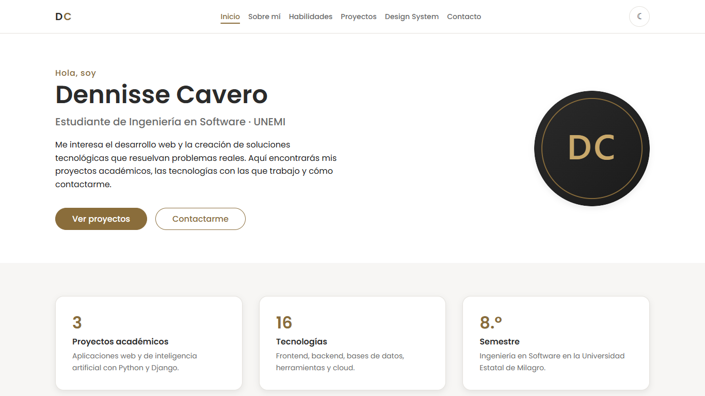
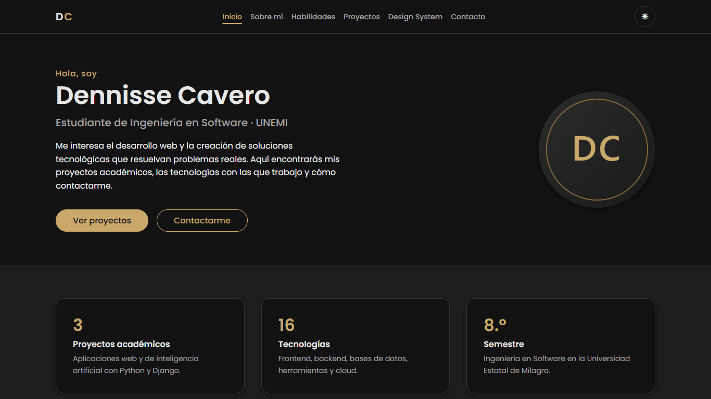
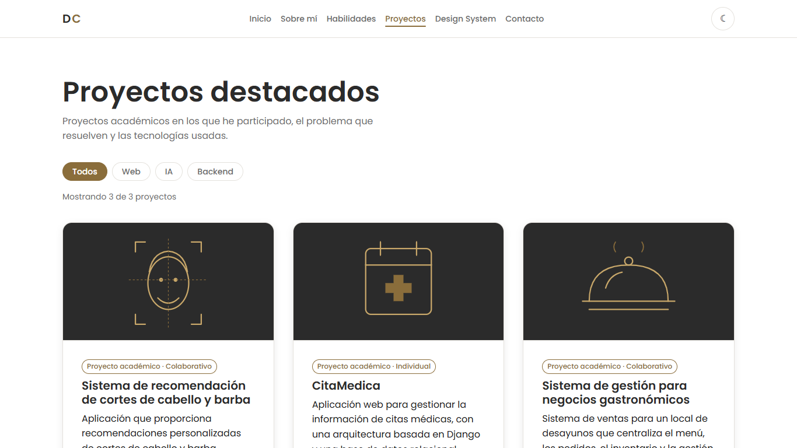
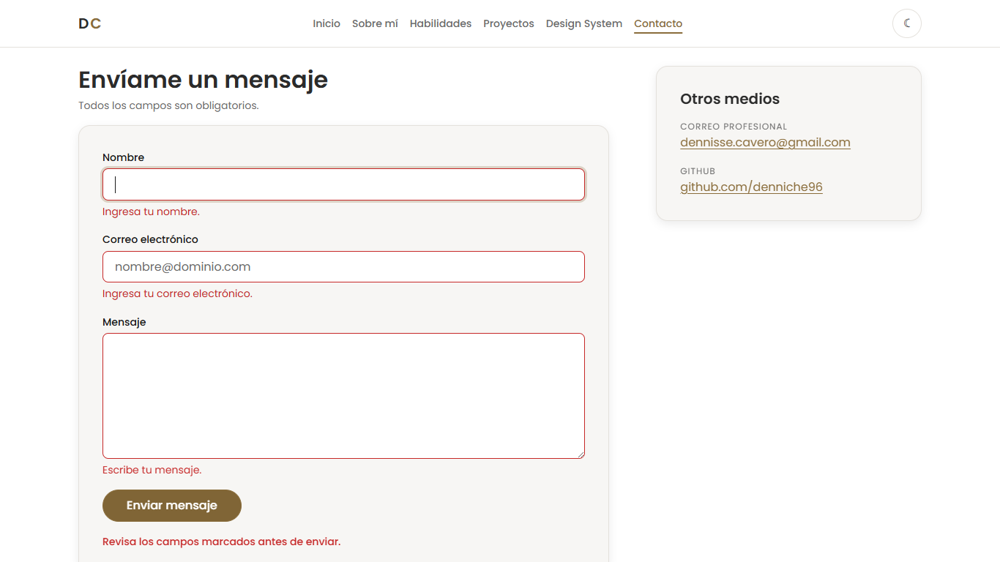
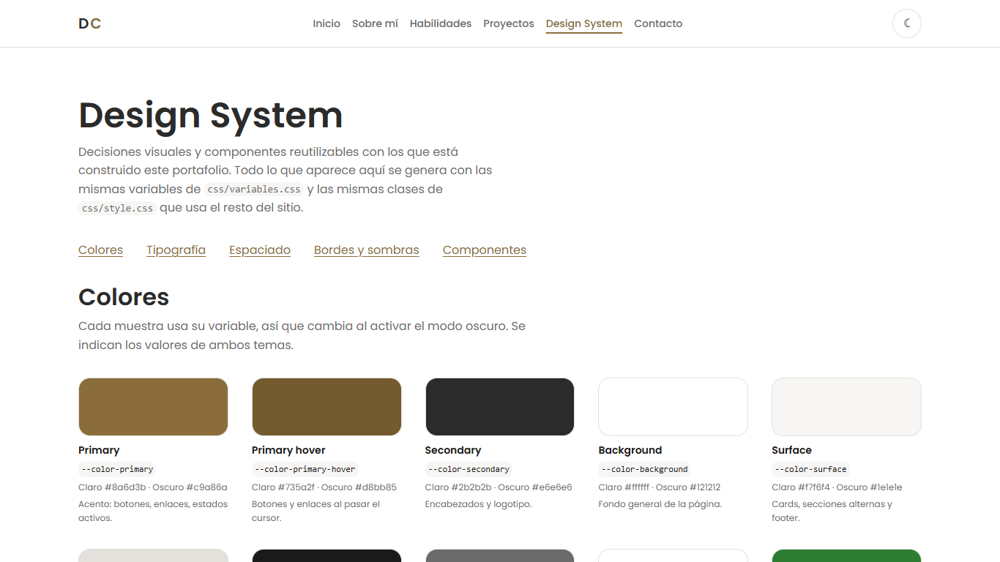
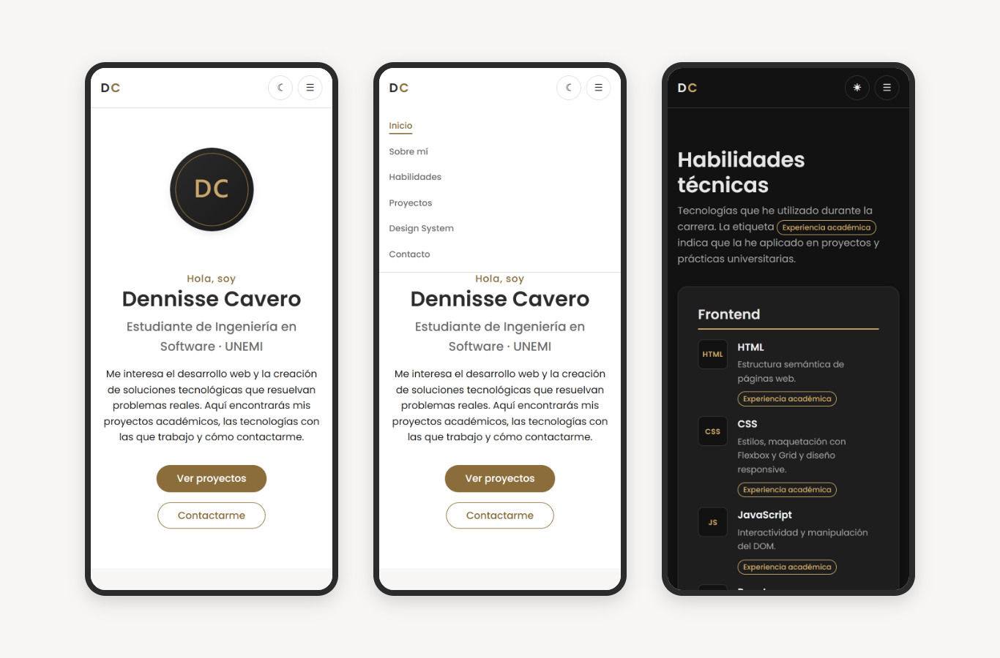

# Portafolio Web Personal — Dennisse Cavero

Portafolio web personal e interactivo desarrollado para el curso de **Desarrollo Web**
de la Universidad Estatal de Milagro (UNEMI).

Presenta mi información académica y profesional, mis proyectos destacados y mis
habilidades técnicas. Está construido con HTML5 semántico, CSS propio y JavaScript,
sin frameworks ni librerías de estilos.

**🔗 Sitio publicado:** https://denniche96.github.io/portafolio-web/

## Tecnologías

- HTML5 semántico
- CSS3 (Custom Properties, Flexbox, Grid y media queries)
- JavaScript
- Git y GitHub
- GitHub Pages

## Páginas

| Página | Contenido |
|---|---|
| Inicio | Presentación, avatar y resumen con accesos a las demás secciones |
| Sobre mí | Perfil, datos rápidos y formación académica |
| Habilidades | Tecnologías organizadas por categoría, sin porcentajes inventados |
| Proyectos | Tres proyectos académicos en cards reutilizables, con filtro por categoría |
| Design System | Colores, tipografía, espaciado, bordes, sombras y componentes del sitio |
| Contacto | Formulario validado, correo profesional y GitHub |

## Características

- **Diseño responsive** para computadora, tablet y móvil, sin desbordamiento horizontal.
- **HTML semántico:** `header`, `nav`, `main`, `section`, `article`, `aside`, `figure`
  y `footer`, un solo `h1` por página y jerarquía de encabezados sin saltos.
- **SEO:** título y descripción únicos por página, `meta author`, URL canónica,
  favicon y Open Graph con imagen para compartir en redes.
- **Accesibilidad:** textos alternativos, enlace para saltar al contenido, atributos
  ARIA en los controles y respeto de la preferencia de movimiento reducido.
- **Design System** documentado con los mismos componentes que usa el sitio.

### Funcionalidades JavaScript

1. **Menú responsive:** el botón ☰ abre y cierra la navegación en móvil.
2. **Modo claro/oscuro:** se guarda en `localStorage` y, en la primera visita, respeta
   la preferencia del sistema operativo.
3. **Filtro de proyectos:** botones Todos, Web, IA y Backend con contador de resultados.
4. **Validación del formulario:** comprueba nombre, correo y mensaje, y muestra errores
   claros. Con datos válidos abre el cliente de correo con el mensaje ya redactado.

## Estructura

```
portafolio-web/
├── index.html            # Inicio
├── sobre-mi.html         # Sobre mí
├── skills.html           # Habilidades
├── proyectos.html        # Proyectos destacados
├── design-system.html    # Design System / Componentes
├── contacto.html         # Contacto
├── css/
│   ├── variables.css     # Tokens: colores, tipografía, espaciado, bordes, sombras
│   └── style.css         # Estilos base, componentes y responsive
├── js/
│   ├── theme-init.js     # Aplica el tema guardado antes de pintar la página
│   └── main.js           # Menú, tema, filtro y validación
└── img/                  # Avatar, favicon, imagen para redes e ilustraciones
```

## Cómo verlo

- **En línea:** https://denniche96.github.io/portafolio-web/
- **En local:** clonar el repositorio y abrir `index.html` en el navegador, o usar la
  extensión Live Server de Visual Studio Code.

```bash
git clone https://github.com/denniche96/portafolio-web.git
```

## Capturas

### Inicio


### Modo oscuro


### Proyectos con filtro


### Validación del formulario


### Design System


### Versión móvil


## Autora

Angela Dennisse Cavero Mosquera · [dennisse.cavero@gmail.com](mailto:dennisse.cavero@gmail.com) ·
[GitHub](https://github.com/denniche96)
